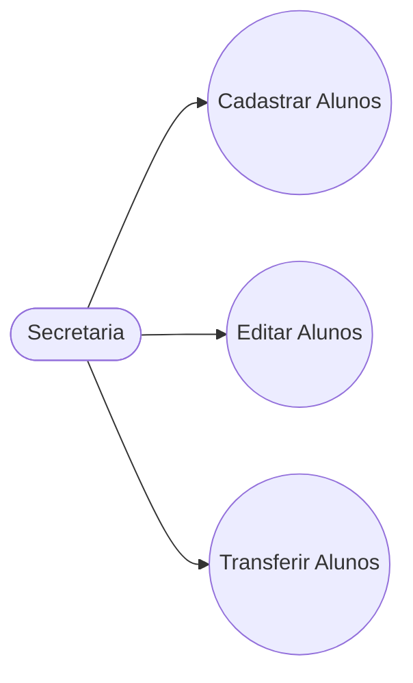
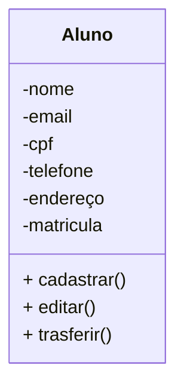

# Projeto Universidade

Modelagem em Orientação á Objetos das entidades alunos, cursos e tumar

## Casos de usos

## Diagrama de Classes

## Dependências
- **VsCode**: IDE (Interface de Desenvolvimento)
- **Mermaid**:Lingagem para confecção em documentos MD (Mark Down)

- **Material Icon Theme**: Tema para colorir as pastas.
- **Git Lens**: Interface grafica para o versionamento git integrado ao VsCode.